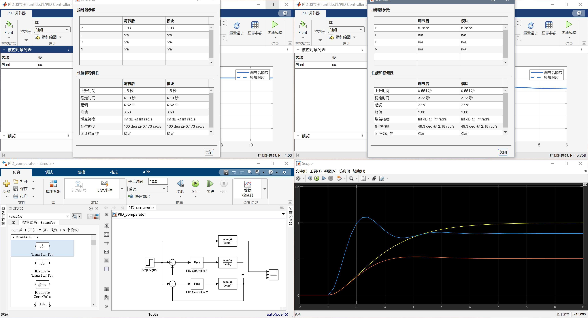
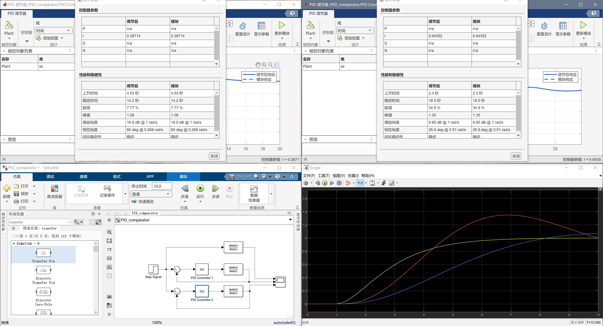

# 经典控制算法（一）线性系统时域分析&连续时间PID控制器

## 线性系统的时域分析

### 动态性能分析

线性系统的时域分析建立于该系统稳定的前提之上（衡量系统的主要指标为稳、快、准，判定稳定性劳斯判据，根轨迹法，频域分析的bode，nyquist不在此说明），对于系统的动态性能通常如下：

| 指标                | 指标内容                                                     |
| ------------------- | ------------------------------------------------------------ |
| 上升时间 $t_r$ | 指相应从终值10\%上升到90\%所需的时间； 对于有震荡的系统，亦可定义为响应从零第一次上升到终值所需的时间。 上升时间是系统相应速度的一种度量，上升时间越短，相应速度越快。 |
| 峰值时间 $t_p$ | 指相应超过其终值到达第一个峰值所需的时间                     |
| 调节时间 $t_s$ | 指响应到达并保持在终值±5\%内所需的最短时间。                 |
| 超调量 σ\%     | 指响应的最大偏离量$c(t_p)$与终值$c(∞)$的差与终值$c(∞)$之比的百分数即：$$σ\%=\frac{c(t_p)-c(∞)}{c(∞)}*100\%$$ 若$c(t_p)<c(∞)$则响应无超调（即超调量为0？） |

通常上述四个动态指标中，$t_r$和$t_p$评价系统的响应速度，用σ\%评价系统的阻尼程度，而$t_s$是同时反应响应速度的综合性能指标。

### 静态性能分析

| 指标          | 指标内容                                                     |
| ------------- | ----------------------------------------------------------- |
| 稳态误差 ess | 若时间趋于无穷是，系统的输出量不等于输入量或输入量的确定函数，则系统存在稳态误差。 稳态误差是系统控制精度或抗扰动能力的一种度量。 |

## PID简介

PID即proportional（比例），integral（积分），differential（微分）。PID控制算法是一种将反馈环节获取的信号转换成控制环节的信号的一种算法。此算法可以使系统处于一种趋于稳定的状态。

连续PID时域式为：
$$
u(t)=K_pe(t)+K_i\int_0^te(τ)dt+K_d\frac{de(t)}{dt}
$$

$K_p$：比例增益

$K_i$：积分增益

$K_d$：微分增益

​		e：误差=终值-反馈值

​		t：目前时间

​		τ：积分变数为数值从0到目前时间t

PID控制器可以视为频域系统的滤波器，其频域传函为：
$$
\begin{align*}
G(s)&=\frac{U(s)}{E(s)}\\
    &=\frac{\mathscr{L}(U(t))}{\mathscr{L}(E(t))}\\
    &=\frac{\mathscr{L}(K_pe(t))+\mathscr{L}(K_i\int_0^te(τ)dt)+\mathscr{L}(K_d\frac{de(t)}{dt})}{\mathscr{L}(E(t))}\\
    &=\frac{K_pE(s)+K_i\frac{E(s)}{s}+K_d(sE(s)-E(0))}{E(s)}\\
    &=\frac{K_pS++K_i+K_dS^2}{S+C}
\end{align*}
$$
E(0)=0(为什么？？？)

C:系统带宽常数

## 比例环节（Proportional）

比例环节中比例系数与系统的响应速度成正比，与阻尼程度成反比。即随着$K_p$增大系统的动态性能$t_r$和$t_p$大幅减小，σ\%增大，$T_s$小幅增大；静态性能ess减小；同时增大$K_p$会有系统震荡的风险，系统稳定性变差。

纯比例环节控制会产生ess，需要积分环节消除。

个人理解：$K_p$意味着控制的分辨率，误差是控制步进单位的系数，而$K_p$意味着步进单位的大小。

## 积分环节（Integral）

积分环节中，随着$K_i$增大，动态性能$t_r$和$t_p$小幅减小，σ\%增大，$T_s$增大；静态性能ess大幅减小，同时增大$K_i$会有系统震荡的风险，系统稳定性变差。

个人理解：积分求得的系统的历史误差之和，即$lim_{t \to \infty}$,其积分可以理解为$ess*t$，那么也可以理解为系统一段时间内的平均误差，那么$K_i$意味着这段平均误差的加权系数。

## 微分环节（Differential）

积分环节中，积分系数与系统的阻尼程度成正比。即随着$K_d$增大，动态性能$t_r$和$t_p$小幅减小，σ\%减小，$T_s$减小；静态性能ess几乎不变，同时增大$K_d$会使系统稳定性变好。

个人理解：微分环节即对误差变化求一阶导，这不是对误差进行分析，而是对此时系统误差是朝着越来越大的趋势还是越来越小趋势的一种分析，$K_d$则是对误差变化率的加权系数。

## PID系数在系统时域上的表现

