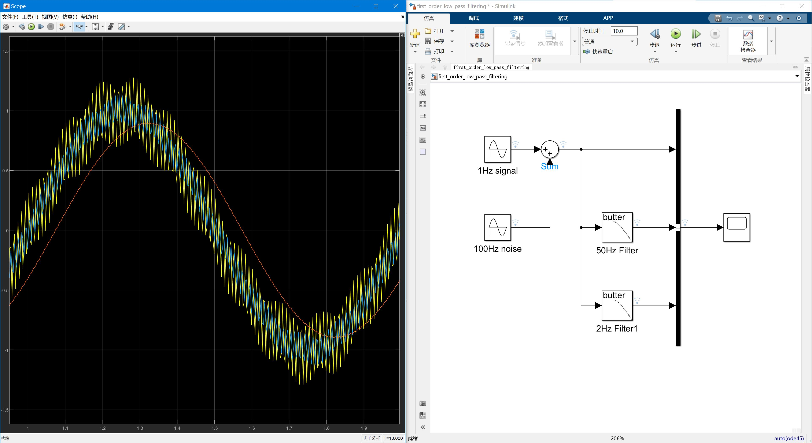
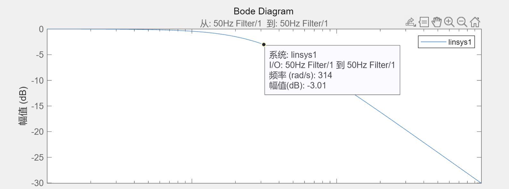

# 滤波算法（一）一阶低通滤波器理论设计&算法实现

## 模型搭建

### 物理模型

一阶低通滤波器的物理模型来源于一阶RC滤波器,其输出信号与电容的容抗和电阻的阻抗形成的电路网络有关，此电路网络是由电阻分压网络衍生而来。

分压电路输出信号如下：

$$
Vout=Vin\frac{R2}{R1+R2}
$$

RC滤波电路输出信号如下：

$$
\begin{align*}
Vout&=Vin\frac{Xc}{\sqrt{R^2+Xc^2}}\\
    &=\frac{\frac{1}{\omega C}}{\sqrt{(\frac{1}{\omega C})^2+R^2}}\\
\end{align*}
$$

### 传递函数

一阶低通滤波器传递函数即（这里的$j\omega$不同于之上的$\omega$,$j\omega$是虚数）：

$$
\begin{align*}
F(jw)&=\frac{Vout(jw)}{Vin(jw)}\\
    &=\frac{Xc}{R+Xc}\\
    &=\frac{\frac{1}{j\omega C}}{\frac{1}{j\omega C}+R}\\
    &=\frac{1}{1+sRC}\\
\end{align*}
$$

实际结果就是一阶低通滤波器在系统分析上为一个典型的惯性环节即：

$$
G(s)=\frac{1}{1+Ts}
$$

其幅频和相频特性为：

$$
\left\{
\begin{aligned}
&A(\omega)=\frac{1}{(1+T^2\omega^2)^\frac{1}{2}}\\
&\varphi(\omega)=-arctanT\omega\\
\end{aligned}
\right.
$$

### Simulink波形仿真



## 参数原理

### 截止频率

在3dB带宽系统中（即半功率系统），信号幅值增益为-3dB（$20\log(0.7079)\approx-3dB$）时的频率为滤波器的截止频率。那么此时输出信号$Vout\approx0.7079Vin$



那么根据RC滤波器输出信号公式且$\omega=2\pi f$可得截止频率

$$
\begin{align*}
0.7079Vin&\approx Vin\frac{Xc}{\sqrt{R^2+Xc^2}}\\
0.7079&\approx\frac{\frac{1}{\omega C}}{\sqrt{(\frac{1}{\omega C})^2+R^2}}\\
0.7079^2&\approx\frac{(\frac{1}{\omega C})^2}{(\frac{1}{\omega C})^2+R^2}\\
(\frac{1}{\omega C})^2&\approx\frac{0.7079^2}{1-0.7079^2}R^2\\
{\omega}&\approx\frac{1}{\sqrt{\frac{0.7079^2}{1-0.7079^2}}RC}\\
f_c&\approx\frac{1}{2\pi RC}\\
\end{align*}
$$

### 相位延迟

相位延迟在上一节传递函数时其实已经提到，即该模型的相频特性：

$$
\begin{align*}
\varphi(\omega)&=-arctan(\omega RC)\\
    &=-arctan(2\pi f RC)
\end{align*}
$$

## 算法实现

### 滤波器离散化

那么实际上一阶低通滤波器就已经可以看作是一阶惯性环节，在数字信号中对一阶惯性环节进行离散化即:

向后差分法$\mathcal{Z}$变换中：

$$
s=\frac{1-z^{-1}}{T}
$$

代入传函中可得：

$$
\begin{align*}
G(z)&=\frac{1}{1+\frac{1-z^{-1}}{T}RC}\\
\frac{C(z)}{R(z)}&=\frac{1}{1+\frac{1-z^{-1}}{T}RC}\\
R(z)&=(C(z)+C(z)\frac{1-z^{-1}}{T}RC)\\
R(z)&=(1+\frac{RC}{T})-C(z)z^{-1}\frac{RC}{T}\\
C(z)&=R(z)\frac{1}{1+\frac{RC}{T}}+C(z)z^{-1}\frac{\frac{RC}{T}}{1+\frac{RC}{T}}\\
\end{align*}
$$

差分化后：

$$
\begin{align*}
C(n)&=R(n)\frac{1}{1+\frac{RC}{T}}+C(n-1)\frac{\frac{RC}{T}}{1+\frac{RC}{T}}\\
&=R(n)\frac{T}{T+RC}+C(n-1)\frac{RC}{T+RC}\\
&=R(n)\frac{T}{T+RC}+C(n-1)\frac{(T+RC)-T}{T+RC}\\
&=C(n-1)+(R(n)-C(n+1))\frac{T}{T+RC}\\
\end{align*}
$$

当$\lim\limits_{T\to 0}$时，$T+RC\approx RC$那么上式：

$$
\begin{align*}
C(n)&=C(n-1)+(R(n)-C(n-1))\frac{T}{RC}\\
&=C(n-1)+2\pi fT(R(n)-C(n-1))\\
&=(1-2\pi fT)C(n-1)+(2\pi fT)R(n)
\end{align*}
$$

将$2\pi fT$转换为系数$\alpha$。

### C语言实现

```c
#define LOW_PASS_FILTERING_ALPHA 0.4f //1~0

typedef struct {
    float value_current;
    float value_last;
} FOLPF_DATATypeDef;

void FLOAT_FirstOrderLowPassFiltering_Process(FOLPF_DATATypeDef *data_pointer){

    data_pointer->value_current=((1-LOW_PASS_FILTERING_ALPHA)*data_pointer->value_last)
                                +(LOW_PASS_FILTERING_ALPHA *data_pointer->value_current);

    data_pointer->value_last=data_pointer->value_current;
}

```
